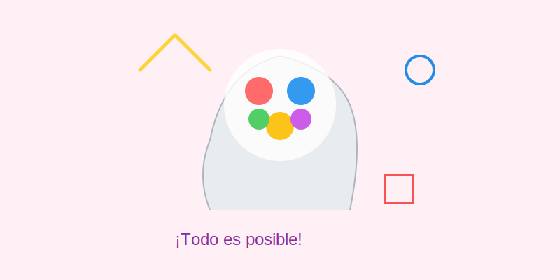
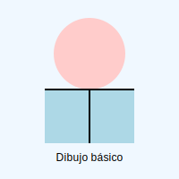
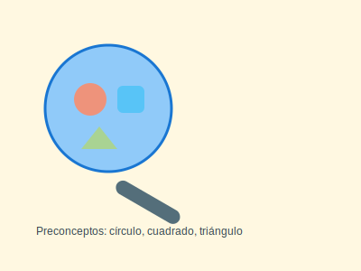

# ¿Qué es el dibujo y por qué es divertido?

**Tiempo estimado**: 15 minutos  
**Nivel**: Básico (6+ años)  
**Prerrequisitos**: Curiosidad y ganas de explorar.

---

## ¿Por qué importa esto?

El dibujo es como un idioma secreto. Antes de que existieran las letras o las palabras escritas, los humanos ya dibujaban en las paredes de las cuevas para contar sus aventuras. Hoy, el dibujo sigue siendo una herramienta superpoderosa.

Cuando aprendes a dibujar, tu cerebro se vuelve más fuerte:

* **Mejora tu observación**: Aprendes a ver detalles que otros ignoran.
* **Conecta tus ojos con tus manos**: Entenas a tu mano para que dibuje exactamente lo que tus ojos ven.
* **Libera tu imaginación**: Es como tener una impresora mágica para sacar las ideas de tu cabeza al mundo real.

---

## Conceptos Básicos

### ¿Qué es dibujar realmente?

Imagina que tu lápiz es una varita mágica. Cuando toca el papel, deja un rastro. Ese rastro puede ser cualquier cosa.

Existen varios "estilos" o formas de dibujar:

1. **Realista**: Cuando intentas que tu dibujo se parezca a una foto (como dibujar a tu perro tal cual es).
2. **Imaginativo**: Cuando inventas cosas que no existen (como un perro con alas de dragón).
3. **Abstracto**: Cuando usas formas y colores para mostrar cómo te sientes, sin dibujar cosas específicas (como dibujar "la alegría" con líneas amarillas saltarinas).

### ¿Por qué nos gusta tanto?

* **Sin reglas**: En el dibujo, un árbol puede ser azul y el cielo verde. ¡Tú mandas!
* **Relax**: Dibujar ayuda a calmar la mente, como cuando sueñas despierto.
* **Comunicación**: Si viajas a un país donde hablan otro idioma y tienes hambre, puedes dibujar una manzana y ¡te entenderán! Es un lenguaje universal.

---

## Mitos del Dibujo (Lo que la gente cree vs. La verdad)

### ❌ Mito: "Se nace sabiendo dibujar"

**✅ Verdad**: Falso. Nadie nace sabiendo. Es como andar en bici o jugar videojuegos: al principio cuesta, pero si practicas, mejoras. Los grandes artistas han practicado miles de horas.

### ❌ Mito: "Si no es perfecto, no sirve"

**✅ Verdad**: Los "errores" son geniales. A veces, una línea chueca te da una idea nueva. No busques la perfección, busca divertirte.

### ❌ Mito: "Necesitas lápices caros"

**✅ Verdad**: Puedes hacer una obra de arte con un lápiz escolar y un papel cualquiera. La magia está en tu mano, no en el lápiz.

---

## Actividad: Tu primer dibujo libre

### Materiales

* Cualquier papel.
* Cualquier lápiz o color.

### Instrucciones

1. **Cierra los ojos** un momento y piensa en algo que te haga sonreír (tu postre favorito, tu juguete, un lugar).
2. **Abre los ojos y dibújalo**.
3. **Regla de Oro**: Prohibido usar borrador. Si te sale una línea que no querías, déjala ahí o conviértela en otra cosa.
4. ¡Disfruta el sonido del lápiz sobre el papel!

---

## Reflexión Final

Dibujar no es un examen. Es un juego. Cada línea que haces es única porque la hiciste tú. A partir de hoy, eres un artista explorador.

**Recuerda**:

* 🎨 Todos pueden dibujar.
* 🚀 La práctica es el secreto.
* 💖 Lo importante es expresarte.

¡Bienvenido a tu aventura artística!

## Galería de Inspiración

