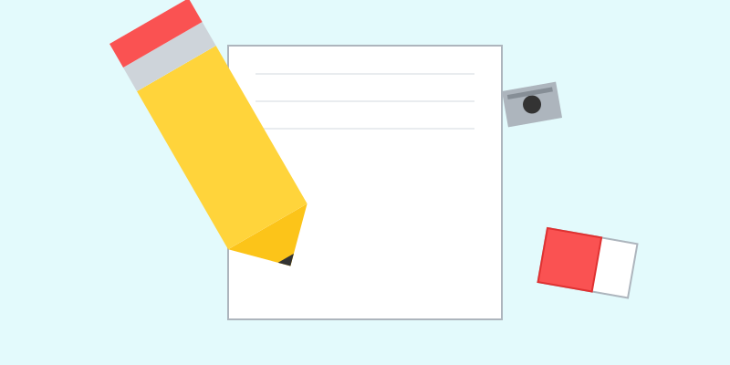
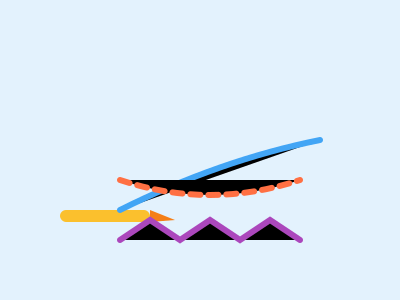

# Conociendo tus materiales mágicos

**Tiempo estimado**: 20 minutos  
**Nivel**: Básico (6+ años)  
**Prerrequisitos**: Ninguno.

---

## ¿Por qué importa esto?

Un chef necesita conocer sus cuchillos y sartenes. Un mago necesita conocer sus pócimas. Tú, como artista, necesitas conocer tus herramientas. Cada una tiene un "superpoder" diferente. Si sabes usarla, podrás hacer cualquier cosa.

---

## Tus Herramientas Básicas

### 1. El Lápiz (El Constructor)

Es tu herramienta principal.

- **¿De qué está hecho?**: Lo que escribe no es plomo, es **Grafito** (un mineral gris suave).
- **Tipos de Lápiz**:
  - **HB**: El lápiz normal de la escuela. Ni muy duro ni muy suave. Ideal para empezar.
  - **2B, 4B, 6B**: Lápices "Blandos". Son más oscuros y suaves. Ideales para sombrear.
- **Superpoder**: Puede corregirse. Si te equivocas, no pasa nada.

### 2. La Goma de Borrar (La Máquina del Tiempo)

Mucha gente cree que es solo para "limpiar errores".

- **Superpoder Real**: Es una herramienta de dibujo. Puedes usarla para sacar luces, hacer brillos o dibujar líneas blancas sobre un fondo gris.
- **Consejo**: Mantenla limpia. Si está sucia, frótala en tu pantalón o un papel aparte antes de borrar.

### 3. El Papel (Tu Mundo)

Es el suelo donde caminan tus dibujos.

- **Tipos**:
  - **Bond**: El normal de impresora. Bueno para bocetos.
  - **Cartulina**: Más grueso. Aguanta mejor si usas marcadores o mucha presión.

---

## Herramientas de Color (La Fiesta)

### Crayones de Cera

- **Lo bueno**: Colores muy brillantes y cubren rápido.
- **Lo malo**: Es difícil hacer líneas finitas.
- **Truco**: Úsalos para rellenar fondos grandes.

### Lápices de Colores

- **Lo bueno**: Tienen punta fina, así que puedes dibujar detalles (como pestañas o pasto).
- **Truco**: Puedes mezclar colores. Si pintas suave con amarillo y luego encima suave con azul... ¡magia! Aparece verde.

### Marcadores

- **Lo bueno**: Color intenso y líquido.
- **Lo malo**: No se pueden borrar y a veces traspasan el papel.
- **Truco**: Úsalos para delinear tus dibujos al final y que se vean terminados.

---

## Tabla de Poderes

| Herramienta     | Superpoder              | Debilidad         |
| :-------------- | :---------------------- | :---------------- |
| **Lápiz**       | Se borra y hace sombras | Es solo gris      |
| **Crayón**      | Rellena rápido          | Punta gorda       |
| **Lápiz Color** | Detalles finos          | Tarda en rellenar |
| **Marcador**    | Color súper fuerte      | ¡No se borra!     |

---

## Organización del Artista

Antes de empezar a dibujar, un artista profesional prepara su "cuartel general":

1. **Luz**: ¿Ves bien lo que haces?
2. **Mesa**: ¿Está limpia? (Cuidado con las migas de pan).
3. **Materiales**: ¿Tienes sacapuntas cerca?

**Regla de Oro**: Al terminar, el artista guarda sus herramientas. Un lápiz en el suelo es un lápiz que se rompe.

## Galería de Inspiración

