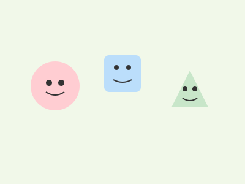

# Garabatos con propósito (Tu gimnasio de dibujo)

**Tiempo estimado**: 25 minutos  
**Nivel**: Básico (6+ años)  
**Prerrequisitos**: Tener tu lápiz y papel listos.

---

## ¿Por qué hacemos garabatos?

¿Has visto a los futbolistas calentar antes del partido? Mueven las piernas, saltan...
Bueno, **tu mano también necesita calentar**.

Si empiezas a dibujar "en frío", tus líneas salen temblorosas y te cansas rápido. Hacer garabatos locos sirve para "despertar" a los músculos de tu mano y decirle a tu cerebro: "¡Hey, vamos a crear!".

### Beneficios secretos

1. **Sueltas el miedo**: Como no es un "dibujo serio", no te preocupa equivocarte.
2. **Controlas la fuerza**: Aprendes a no romper el papel.
3. **Descubres formas**: A veces, un garabato se parece a un dragón sin querer.

---

## Tipos de Garabatos Útiles

### 1. El Torbellino (Movimiento de Brazo)

Hacer círculos grandes y rápidos usando todo tu brazo, no solo la muñeca.

* **Para qué sirve**: Para dibujar cosas grandes con confianza.

### 2. El Fantasma y el Trueno (Control de Presión)

Hacer líneas tan suaves que casi no se ven (Fantasma) y líneas oscuras y fuertes (Trueno).

* **Para qué sirve**: Para cuando quieras hacer bocetos (suave) o líneas finales (fuerte).

### 3. La Lluvia (Texturas)

Llenar la hoja de puntitos, rayitas cortas o zigzags.

* **Para qué sirve**: Para aprender a dibujar pasto, lluvia, pelo de animales o rocas.

---

## Cómo agarrar el lápiz

No siempre tienes que agarrarlo igual. ¡Eres libre!

1. **Agarre de Escritura**: Como cuando escribes tu nombre.
    * *Úsalo para:* Detalles pequeñitos (ojos de una hormiga).
2. **Agarre de Varita Mágica**: Agarra el lápiz desde más arriba (cerca de la goma), de forma suave.
    * *Úsalo para:* Dibujos grandes, bocetos rápidos y líneas suaves. ¡Pruébalo! Se siente raro al principio, pero es genial.

---

## Regla de Oro del Garabato

**¡No levantes el lápiz!**
Trata de llenar toda la hoja con una sola línea interminable que se cruza a sí misma mil veces. Es como un hilo enredado.

## Galería de Inspiración

