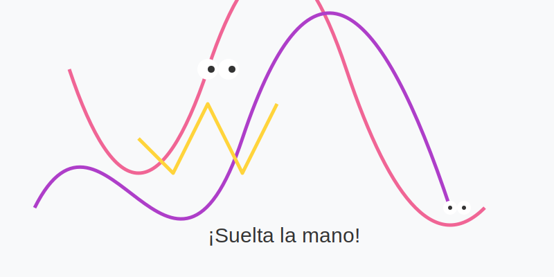
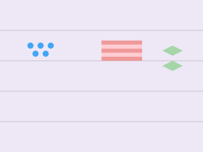

# El juego de las líneas locas

**Tiempo estimado**: 25 minutos  
**Nivel**: Básico (6+ años)  
**Prerrequisitos**: Saber agarrar el lápiz con confianza.

---

## Las líneas tienen personalidad

Las líneas son como actores en una película. Cada una transmite una emoción diferente. Si aprendes a usarlas, tus dibujos tendrán "sentimiento".

### 1. La Línea Recta (El Soldado)

Es firme, seria y fuerte. No se dobla.

* **Horizontal (—)**: Está dormida o tranquila. (Como el mar en calma).
* **Vertical (|)**: Está parada y atenta. (Como un árbol o un poste).
* **Diagonal (/)**: ¡Se está cayendo o corriendo! (Como la lluvia o alguien corriendo).

### 2. La Línea Curva (La Nube)

Es suave, amable y gordita.

* **Para qué sirve**: Para dibujar cosas vivas (animales, frutas, personas) y cosas suaves (almohadas, nubes).
* **Secreto**: Casi nada en la naturaleza es perfectamente recto. ¡La naturaleza ama las curvas!

### 3. El Zigzag (El Rayo)

Es picudo, rápido y peligroso. ¡Pinch!

* **Para qué sirve**: Para dibujar explosiones, enojo, dientes de monstruo o montañas rocosas.
* **Sensación**: Transmite energía y ruido.

### 4. La Espiral (El Caracol)

Gira y gira y te marea.

* **Para qué sirve**: Para cosas mágicas, caparazones, remolinos de agua o viento.

### 5. La Línea Punteada (El Camino de Hormigas)

No es una línea completa, son saltitos.

* **Para qué sirve**: Para mostrar el camino de una abeja o cosas invisibles (como el viento).

---

## Cómo combinarlas

Un buen artista usa TODAS las líneas.

* Si dibujas un **castillo**, usas líneas rectas (fuertes).
* Si dibujas al **rey** gordito dentro del castillo, usas líneas curvas (suaves).
* Si dibujas al **dragón** atacando, usas zigzags (peligro).

¡Es como cocinar! Mezcla los ingredientes para que quede rico.

## Galería de Inspiración

