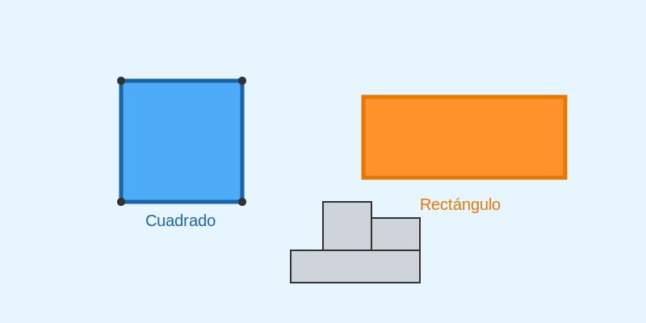
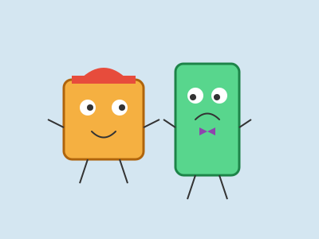
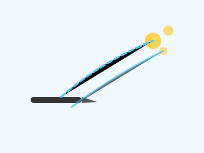

# Cuadrados y Rectángulos (El Club de las Esquinas)

**Tiempo estimado**: 30 minutos  
**Nivel**: Básico (6+ años)  
**Prerrequisitos**: Saber hacer líneas rectas.

---

## ¿Por qué importan estas formas?

El círculo rueda y es suave. Pero si quieres construir una casa, una mesa o una caja, necesitas formas que se queden quietas.
El Cuadrado y el Rectángulo son los "ladrillos" del dibujo. Son fuertes y estables.

---

## Diferencias Clave

### 1. El Cuadrado (El Hermano Perfecto)

* Tiene **4 lados IGUALES** (miden lo mismo).
* Tiene **4 esquinas idénticas**.
* **Ejemplos**: Un dado, una ventana cuadrada, una servilleta doblada.

### 2. El Rectángulo (El Hermano Estirado)

* Tiene **2 lados largos y 2 lados cortos**.
* También tiene 4 esquinas idénticas.
* **Ejemplos**: Una puerta, un celular, un billete, una hoja de papel.

---

## Conceptos Importantes (Palabras de Artista)

### 1. Ángulo Recto (La "L")

Las esquinas de los cuadrados no son ni muy abiertas ni muy cerradas. Son perfectas, como una "L" mayúscula.

* *Prueba*: Haz una L con tu dedo índice y pulgar. ¡Eso es un ángulo recto!

### 2. Líneas Paralelas (Las Vías del Tren)

Los lados de un cuadrado son paralelos. Significa que viajan en la misma dirección y **nunca se tocan**, como las vías de un tren.

---

## Cómo dibujarlos sin regla

**Truco del Punto Guía**:

1. Dibuja la línea de arriba.
2. Dibuja la línea de abajo (trata de que sea del mismo tamaño).
3. ¡Ahora solo conecta los extremos!

**Truco de la Ventana**:

1. Dibuja una cruz (+).
2. Cierra las puntas con líneas rectas.

---

## Errores Comunes

* **La Torre de Pisa**: A veces las líneas verticales nos salen chuecas.
  * *Solución*: Mira el borde de tu papel. Tu línea debe ser paralela al borde del papel.
* **El Trapecio**: El lado de arriba es más corto que el de abajo.
  * *Solución*: Mide con tus dedos o lápiz antes de trazar.

## Galería de Inspiración

