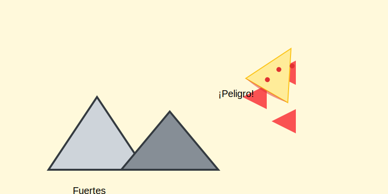
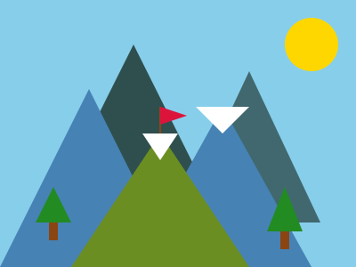

# Triángulos (La Forma Más Fuerte)

**Tiempo estimado**: 30 minutos  
**Nivel**: Básico (6+ años)  
**Prerrequisitos**: Saber conectar puntos.

---

## ¿Por qué el Triángulo es especial?

El círculo rueda. El cuadrado es estable. ¿Y el triángulo?
¡El triángulo es **FUERTE**!

Si intentas aplastar una caja de cartón (cuadrada), se dobla fácil. Pero si intentas aplastar una pirámide... ¡no puedes! Por eso los puentes, las bicicletas y las torres Eiffel están llenas de triángulos.

---

## La Familia Triángulo

Todos tienen 3 lados y 3 puntas, pero tienen diferentes personalidades:

### 1. El Triángulo Perfecto (Equilátero)

* **Cómo es**: Sus 3 lados miden exactamente lo mismo.
* **Parece**: Una señal de tránsito de "Ceda el paso" o una pirámide perfecta.
* **Sensación**: Calma y perfección.

### 2. El Triángulo Techo (Isósceles)

* **Cómo es**: Tiene dos lados largos iguales y uno corto abajo.
* **Parece**: El techo de una casa, un tipi indio, o una rebanada de pizza larga.
* **Sensación**: Apunta hacia el cielo.

### 3. El Triángulo Rampa (Rectángulo)

* **Cómo es**: Tiene una esquina recta (como la de un cuadrado) y una bajada.
* **Parece**: Una resbaladilla, una rampa de patineta, o un sándwich cortado a la mitad.
* **Sensación**: Movimiento y velocidad.

---

## Cómo dibujarlos (Técnica Ninja)

El secreto para un buen triángulo no es dibujar líneas... es **dibujar puntos**.

1. Dibuja 3 puntos en tu hoja donde tú quieras. (Punto A, Punto B, Punto C).
2. Ahora juega a "conectar los puntos" con líneas rectas.
3. ¡Boom! Aparece un triángulo.

*Si pones los puntos cerca, sale un triángulo chiquito. Si los pones lejos, sale uno gigante.*

---

## Dónde encontrar triángulos

* **Comida**: Pizza, nachos, sandía cortada, conos de helado.
* **Naturaleza**: Montañas, pinos, picos de pájaro, aletas de tiburón.
* **Ciudad**: Velas de barco, señales de peligro, techos.

## Galería de Inspiración

