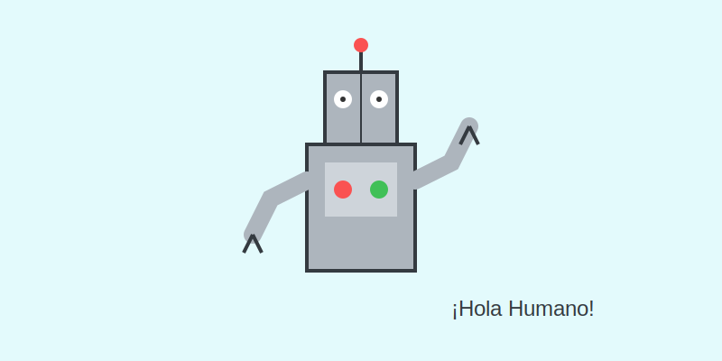
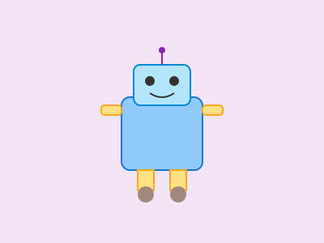
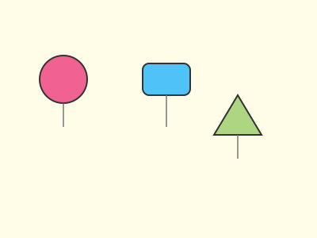

# Robots Geométricos (Tu Fábrica de Personajes)

**Tiempo estimado**: 40 minutos  
**Nivel**: Básico-Intermedio (6+ años)  
**Prerrequisitos**: Saber dibujar círculos, cuadrados y rectángulos.

---

## ¡Construyamos un Amigo Metálico

Dibujar personas es difícil, ¡pero dibujar robots es súper divertido!
¿Por qué? Porque **no hay reglas**.
Un robot puede tener 4 brazos, una rueda en lugar de pies, o una tele en la panza.

Lo único que necesitas es usar tus **Formas Geométricas**:

* Cuadrados y Rectángulos = Cuerpo fuerte.
* Círculos = Articulaciones (codos y rodillas) y ojos.
* Líneas = Antenas y cables.

---

## Menú de Piezas de Robot

Imagina que estás en un supermercado de partes de robot. ¿Qué vas a elegir?

### 1. La Cabeza

* **Cabeza de Tele**: Un rectángulo con antenas. (Clásico).
* **Cabeza de Foco**: Un círculo o un óvalo. (Simpático).
* **Cabeza de Caja**: Un cuadrado perfecto. (Serio).

### 2. El Cuerpo

* **Cuerpo Tanque**: Un cuadrado grande y ancho.
* **Cuerpo Torre**: Un rectángulo alto y flaco.
* **Cuerpo de Barril**: Un círculo o un óvalo gordo.

### 3. Brazos y Piernas

* **Estilo Manguera**: Líneas curvas y flexibles (como fideos).
* **Estilo Bloque**: Rectángulos conectados con circulitos.
* **Estilo Pinza**: Palitos con una "C" en la punta para agarrar cosas.

---

## Consejos de Ingeniero

1. **Articulaciones**: Si quieres que tu robot doble el brazo, dibuja un círculo pequeño (como una tuerca) entre el hombro y el brazo.
2. **Estabilidad**: Si dibujas pies muy chiquitos, tu robot se caerá. ¡Dibújalos grandes y planos!
3. **Botones**: Un robot sin botones no es un robot. Llena su panza de círculos y cuadraditos de colores.

---

## Ideas de Robots Famosos

* **R2-D2**: Es casi puro círculo y rectángulo redondeado.
* **Wall-E**: Son cubos y ojos tristes.
* **Baymax**: Son puros óvalos inflados.

## Galería de Inspiración

