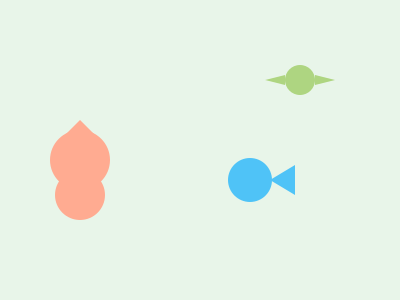

# Animales con Formas Simples (El Zoológico Secreto)

**Tiempo estimado**: 40 minutos  
**Nivel**: Básico-Intermedio (6+ años)  
**Prerrequisitos**: Saber dibujar círculos, óvalos y triángulos.

---

## La Fórmula Secreta de los Animales

¿Sabías que todos los animales del mundo están hechos de formas simples?
No necesitas ser un experto para dibujar un león o un pez. Solo necesitas tus "Lentes de Geometría".

* **Cabeza** = Círculo
* **Cuerpo** = Óvalo (como un huevo)
* **Orejas y Picos** = Triángulos
* **Patas** = Rectángulos

---

## Recetas para Dibujar Animales

### 1. El Gato (🐱)

* **Cabeza**: Círculo.
* **Orejas**: Dos triángulos arriba.
* **Cuerpo**: Un óvalo acostado.
* **Bigotes**: 3 líneas a cada lado (¡Muy importante!).
* **Cola**: Una "S" larga y peluda.

### 2. El Pájaro (🐦)

* **Cuerpo**: Un óvalo inclinado (como un huevo cayendo).
* **Cabeza**: Un círculo pegado arriba.
* **Pico**: Un triángulo chiquito.
* **Ala**: Un óvalo más pequeño dentro del cuerpo.

### 3. El Pez (🐠)

* **Cuerpo**: Un óvalo acostado.
* **Cola**: Un triángulo pegado atrás.
* **Aletas**: Triángulos chiquitos arriba y abajo.
* **Escamas**: Muchas curvas "c c c" en el cuerpo.

### 4. El Cerdito (🐷)

* **Cuerpo**: Un círculo grande y gordo.
* **Nariz**: Un óvalo acostado con dos puntitos.
* **Orejas**: Triángulos caídos.
* **Cola**: Un resorte (espiral).

---

## Trucos para darles Vida

### Ojos Mágicos

La expresión cambia según los ojos:

* 👀 **Ojos grandes y juntos** = Tierno (Bebé).
* 😠 **Ojos con cejas inclinadas** = Enojado.
* 😴 **Ojos cerrados (líneas)** = Dormido.

### Poses Diferentes

No los dibujes siempre de lado.

* **Sentado**: Dibuja el cuerpo vertical (como un huevo parado).
* **Corriendo**: Estira las patas hacia adelante y atrás.

---

## El Secreto del Pelaje

No necesitas dibujar cada pelo.

* Para un animal **peludo** (como un perro), haz líneas cortitas en el borde.
* Para un animal **liso** (como un delfín), haz una línea continua y suave.

## Galería de Inspiración

