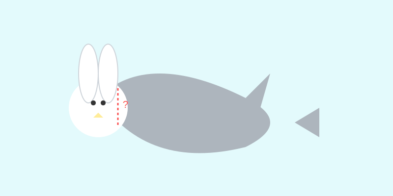

# Híbridos Imposibles

**Tiempo estimado**: 40 minutos  
**Nivel**: Creativo (8+ años)  
**Técnica Clave**: Texturas de Transición (La Costura Invisible)

---

## 1. ¿Qué es un Híbrido?

Un híbrido es la fusión de dos cosas súper diferentes.

* Caballo + Humano = **Centauro**.
* León + Águila = **Grifo**.

El problema es que, si solo dibujas una cabeza pegada a un cuerpo, parece un **recorte de revista**. ¡Se ve falso!
Hoy aprenderemos a "coser" los animales para que parezca que nacieron así.

---

## 2. La Técnica: La Costura Invisible

¿Cómo unes la piel suave de un humano con el pelo de un caballo?
No uses una línea recta. Usa una **Zona de Mezcla**.

### Las 3 Reglas de la Fusión

1. **Entrelazado**: Haz que los pelos del caballo suban un poco sobre la piel humana. (Como dientes de un cierre).
2. **Gradiente**: Si pasas de escamas (pez) a piel lisa (delfín), haz las escamas cada vez más pequeñas hasta que desaparecen.
3. **Collar Mágico**: Si es muy difícil, ¡ponle un collar, una bufanda o una armadura justo en la unión! (Es un truco de dibujante perezoso, pero funciona).

---

## 3. Experimento "Frankenstein": El Tiburonejo

Vamos a practicar con dos animales opuestos:

1. **Tiburón**: Liso, mojado, peligroso, gris.
2. **Conejo**: Peludo, suave, tierno, blanco.

**¿Cómo los unes?**

* **Opción A (Mutante)**: Cuerpo de tiburón, pero con textura de PELO mojado.
* **Opción B (Terror)**: Cabeza de conejo (orejas largas), pero SIN pelo. Piel de tiburón gris y dientes afilados. ¡Miedo total!

---

## 4. Ejemplos de Texturas

* **Plumas a Escamas**: Las plumas se vuelven pequeñas y duras hasta parecer escamas.
* **Piedra a Carne**: Dibuja grietas en la piedra que se convierten en arrugas en la piel.
* **Fuego a Humo**: Líneas picudas (fuego) que se vuelven curvas y suaves (humo).

---

## 5. Errores Comunes

### ❌ Error: "La Línea Recta"

* **Problema**: Trazar una línea dura separando la cabeza del cuerpo.
* **Solución**: ¡Borra esa línea! Usa textura (pelitos, arrugas o manchas) para esconder la unión.

### ❌ Error: "Escala Loca"

* **Problema**: Poner unas patas de hormiga en un elefante.
* **Solución**: Ajusta el tamaño. Si juntas animales, haz que sus tamaños coincidan (o haz las patas de hormiga GIGANTES y musculosas).
