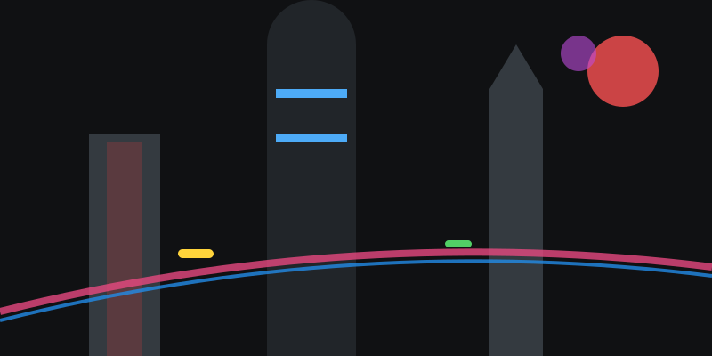

# La ciudad del futuro

**Tiempo estimado**: 50 minutos  
**Nivel**: Creativo-Avanzado (8+ años)  
**Concepto Clave**: Escala y Formas Geométricas Avanzadas

---

## 1. Adiós a las Cajas de Zapatos

Mira por tu ventana. La mayoría de los edificios son cajas rectangulares aburridas.
¡En el futuro eso se acabó!
La arquitectura del futuro usa formas atrevidas: Esperas, donas, agujas, espirales.

---

## 2. Los Dos Futuros (Estilos)

Para inspirarte, elige uno de estos dos estilos famosos:

### A. Solarpunk (Futuro Verde)

* **Filosofía**: Tecnología + Naturaleza.
* **Formas**: Curvas, suaves, blancas, cristal.
* **Detalles**: Árboles en los techos, cascadas cayendo de edificios, paneles solares, molinos de viento.
* **Vibe**: Feliz, brillante, limpio.

### B. Cyberpunk (Futuro Neón)

* **Filosofía**: Alta Tecnología + Mucha Gente.
* **Formas**: Cuadradas, agresivas, amontonadas.
* **Detalles**: Cables colgando, tuberías, humo, luces de NEÓN, pantallas gigantes con anuncios.
* **Vibe**: Oscuro, misterioso, eléctrico.

---

## 3. El Truco Mágico: LA ESCALA

¿Cómo haces que un edificio se vea GIGANTE en el papel?
**Truco**: Dibuja algo pequeñito al lado para comparar.

* Si dibujas un edificio solo, no sé si mide 1 metro o 1 kilómetro.
* Si dibujas una **nave espacial pequeñita** volando al lado de la torre... ¡BOOM! Ahora sé que la torre es inmensa.

---

## 4. Paso a paso: Construyendo Metrópolis

1. **Suelo (o sin suelo)**: ¿Tu ciudad flota entre nubes? ¿O está en el suelo?
2. **Edificios Principales**: Dibuja 3 formas grandes (Una aguja, un arco, una esfera).
3. **Conexiones**: En el futuro no cruzamos la calle caminando. Dibuja **Puentes Aéreos** (tubos o carreteras) que conectan los edificios en las alturas.
4. **Tráfico Aéreo**: Dibuja puntitos o líneas de autos voladores creando "ríos" de tráfico en el cielo.

---

## 5. Errores Comunes

### ❌ Error: "Ventanas de Ajedrez"

* **Problema**: Llenar todo el edificio con cuadritos iguales (aburrido).
* **Solución**: Haz bandas de cristal, ventanas redondas o zonas sin ventanas. ¡Varía!

### ❌ Error: "Falta de Vida"

* **Problema**: Una ciudad vacía parece maqueta.
* **Solución**: Pon luces, antenas, humo, naves... ¡Que se vea que ahí vive gente (o robots)!
