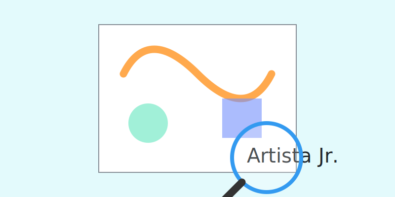

# Firma y montaje

**Tiempo estimado**: 30 minutos  
**Nivel**: Todos (6+ años)  
**Concepto Clave**: Presentación Profesional

---

## 1. El Sello de Garantía: Tu Firma

Un dibujo sin firma es un huérfano. Nadie sabe quién lo hizo.
Firmar tu obra es mirar al mundo y decir: **"Yo creé esto y estoy orgulloso"**.

### Reglas de Etiqueta para Firmar

1. **¿Dónde?**: Esquina Inferior Derecha (casi siempre).
2. **¿Tamaño?**: Pequeña y discreta. No debe ser más grande que el dibujo.
3. **¿Color?**: Usa un color que combine o lápiz grafito. No uses un plumón rojo gigante si arruina la armonía del cuadro.
4. **Fecha**: Es buena idea poner el año (ej. '24) chiquito al lado. En el futuro te gustará saber cuándo lo hiciste.

---

## 2. El Traje de Gala: El Pasepartout

¿Qué es un **Pasepartout**? (Se pronuncia "Pas-par-tú").
Es ese marco de cartón que va alrededor del dibujo y lo hace ver elegante.
No necesitas madera cara. Podemos hacerlo con cartulina.

### Instrucciones de Montaje Casero

1. Consigue una cartulina NEGRA o GRIS (colores neutros).
2. Córtala para que sea unos 4 o 5 cm más grande que tu dibujo por cada lado.
3. Pega tu dibujo JUSTO EN EL CENTRO.
4. ¡Magia! Ese borde negro hace que los colores de tu dibujo "salten" y brillen más.

---

## 3. Protección

Si usaste tizas (gis pastel) o lápiz muy suave, el dibujo se puede manchar si lo tocas.

* **Truco Casero**: Pídele a un adulto que le rocíe un poco de "Spray para el Cabello" (Laca) desde lejos. Funciona como fijador y protege el polvo.

---

## 4. Resumen Visual

1. **Firma**: Abajo a la derecha, pequeña.
2. **Monta**: Sobre cartulina negra centrada.
3. **Protege**: Con cuidado.
