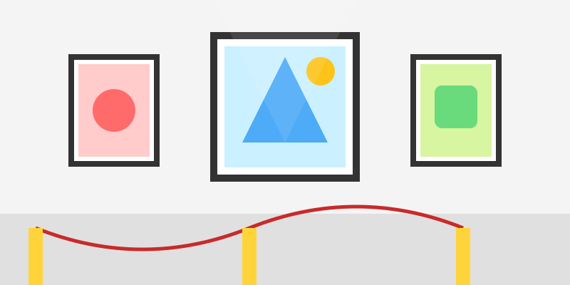

# La Exposición de Arte

**Tiempo estimado**: 40 minutos (El evento)  
**Nivel**: Todos (6+ años)  
**Concepto Clave**: Comunicación y Celebración

---

## 1. El Arte es para Compartir

Imagina que escribes una carta hermosa y la rompes sin que nadie la lea. Qué triste, ¿no?
El arte es una carta visual al mundo.
Exponer tu dibujo (mostrárselo a otros) es la parte final del ciclo.
No se trata de presumir. Se trata de decir: **"Así veo yo el mundo. ¿Te gusta?"**.

---

## 2. Tu Galería en Casa

Organiza una inauguración real:

1. **La Pared**: Pega tus mejores 3 dibujos del curso en la pared de la sala o en el refrigerador.
2. **La Luz**: Pon una lámpara apuntando a los dibujos.
3. **Los Invitados**: Invita a tu familia a una hora específica ("La expo abre a las 6:00 PM").
4. **El Brindis**: ¡Sirve limonada y galletas!

---

## 3. La Cédula (La Ficha Técnica)

En los museos, al lado del cuadro hay un papelito. Tienes que hacerlo:

* **Título**: Ponle un nombre épico a tu obra. ("El Último Dragón").
* **Autor**: Tu nombre.
* **Técnica**: "Lápices de color sobre papel".
* **Mensaje**: Una frase corta sobre qué significa para ti.

---

## 4. Recibiendo Aplausos (y Críticas)

Cuando alguien mire tu dibujo, pregúntale:

* "¿Qué sientes al verlo?"
* "¿Cuál es tu parte favorita?"

Si te dicen "¿Qué es esa mancha?", no te ofendas. Explícales: "Es un asteroide".
Ser artista también es aprender a platicar sobre tu obra.

---

## 5. ¡Graduación

¡Lo lograste! Ha sido un viaje increíble.

* Aprendiste a ver formas.
* Aprendiste a mezclar colores.
* Aprendiste perspectiva, luz, cuerpo humano y animales.
* Pero lo más importante: **Aprendiste a no tenerle miedo a la hoja en blanco.**

Eres un Artista. Nunca dejes de dibujar.

---

## 6. Resumen Visual

1. **Cuelga**: Tus obras en la pared.
2. **Etiqueta**: Ponle título y nombre.
3. **Invita**: A tu público.
4. **Celebra**: ¡Eres un crack!
