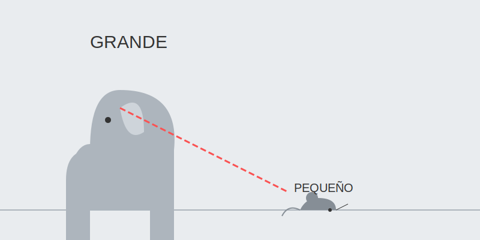

# Misión: Grande vs. Pequeño (Juego de Tamaños)

**Tiempo estimado**: 35 minutos  
**Nivel**: Básico-Intermedio  
**Prerrequisitos**: Comparar cosas.

---

## La Regla de Ricitos de Oro

En el dibujo, el tamaño importa mucho.
Imagina a la familia de osos:

* **Papá Oso (Grande)**: Se ve fuerte, importante o **CERCA**.
* **Mamá Osa (Mediana)**: Tamaño normal.
* **Bebé Oso (Pequeño)**: Se ve tierno, insignificante o **LEJOS**.

Si dibujas una hormiga del tamaño de un elefante... ¡tienes una hormiga monstruo! (O un elefante bebé).

---

## Dos Trucos Mágicos de Tamaño

### 1. Jerarquía (¿Quién manda?)

El objeto más importante de tu dibujo debe ser el más grande.

* Si dibujas tu cumpleaños, **TÚ** debes ser grande. El pastel también.
* Los globos del fondo pueden ser pequeños.

### 2. Distancia (Lejos y Cerca)

Este es el truco número 1 de los artistas:

* **Cosas Grandes** = Parecen estar cerca de tu nariz.
* **Cosas Pequeñas** = Parecen estar a kilómetros de distancia.

Si dibujas dos árboles, uno grande y uno pequeñito... ¡automáticamente parece un bosque profundo!

---

## Cómo Planear tu Hoja

Error común: Empezar dibujando la cabeza del perro gigante y que luego no te quepan las patas.
**Solución**:

1. Antes de dibujar, marca con el dedo o un lápiz suave dónde va a ir cada cosa.
2. "Aquí va el perro (grande)".
3. "Aquí va la pelota (pequeña)".
4. ¡Primero planea, luego dibuja!
