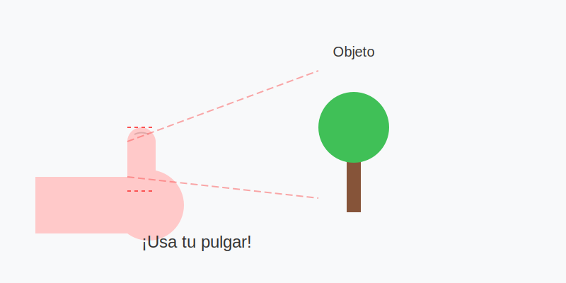

# Misión: La Regla del Pulgar (Medir sin Regla)

**Tiempo estimado**: 40 minutos  
**Nivel**: Intermedio-Avanzado (8+ años)  
**Prerrequisitos**: Saber cerrar un ojo.

---

## El Superpoder de los Artistas

¿Has visto que los pintores cierran un ojo y levantan el lápiz?
No están locos. Están **MIDIENDO**.

El lápiz es una regla mágica. No mide centímetros (1, 2, 3...). Mide **RELACIONES** (Doble, Mitad, Igual).

**Ejemplo**:

* No me importa cuánto mide la cabeza del perro en centímetros.
* Me importa saber que la cabeza cabe **2 veces** en su cuerpo.
* ¡Eso es proporción!

---

## La Técnica del Brazo de Robot

Si doblas el codo, fallas. La medida cambia.
Para medir bien, tienes que convertirte en un robot.

1. **Brazo de Robot**: Estira el brazo COMPLETAMENTE. Codo trabado.
2. **Ojo Pirata**: Cierra un ojo (siempre el mismo).
3. **El Pulgar**: Mueve tu dedo pulgar sobre el lápiz para marcar una medida.

---

## Cómo Medir

1. Alinea la punta del lápiz con la parte de arriba del objeto.
2. Pon tu pulgar en la parte de abajo.
3. ¡Congela tu dedo! Esa es tu medida ("1 Cabeza").
4. Ahora mueve el brazo y cuenta cuántas "Cabezas" caben en el resto del cuerpo.

**Resultado**: "¡Ajá! El cuerpo mide 3 cabezas".
Ahora dibuja el cuerpo 3 veces más grande que la cabeza. ¡Quedará perfecto!
