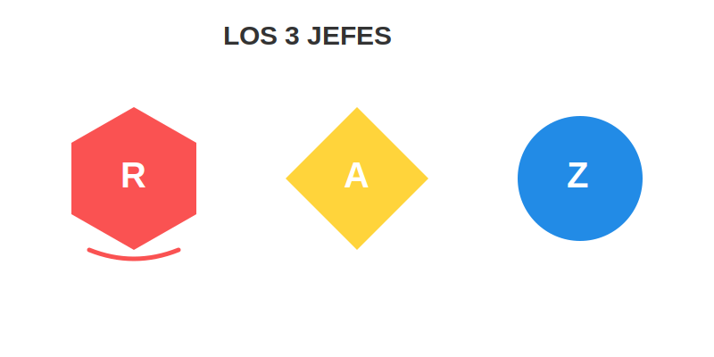

# Misión: Los 3 Jefes (Colores Primarios)

**Tiempo estimado**: 35 minutos  
**Nivel**: Básico  
**Prerrequisitos**: Tener ojos y lápices.

---

## Los Magos del Color

Imagina una caja de colores con 100 lápices.
Ahora imagina que se te pierden TODOS, menos 3.
¿Qué haces? ¿Lloras?

¡No! Si te quedan los **3 JEFES**, puedes volver a crear todos los demás colores.

Los Jefes (Primarios) son:

1. 🔴 **ROJO** (Como la sangre o el fuego).
2. 🟡 **AMARILLO** (Como el sol o el plátano).
3. 🔵 **AZUL** (Como el cielo o el mar).

---

## ¿Por qué son Jefes?

Porque son **PUROS**.

* Tú puedes CREAR el color Verde (mezclando Azul y Amarillo).
* Tú puedes CREAR el color Naranja (mezclando Rojo y Amarillo).
* **¡Pero nadie puede crear el Rojo, el Azul o el Amarillo!**

Ellos son los padres de todos los demás colores. Son irremplazables.

---

## Misión de Hoy: Pureza

Hoy NO vamos a mezclar. Vamos a usar los colores con toda su fuerza.
Queremos ver qué tan brillante es el amarillo y qué tan fuerte es el rojo.
Estilos como el de **Mondrian** o los superhéroes (Superman, Mujer Maravilla) usan estos colores porque son los que más llaman la atención.
