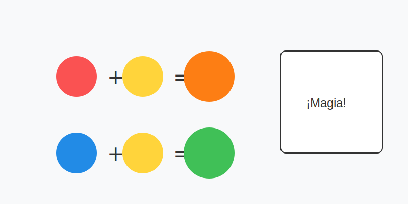

# Misión: Magia de Colores (Mezclas)

**Tiempo estimado**: 45 minutos  
**Nivel**: Básico  
**Prerrequisitos**: Tener los 3 Jefes (Rojo, Azul, Amarillo).

---

## Matemáticas Mágicas

¿Qué pasa si tienes lápices rojo, azul y amarillo... pero quieres dibujar un sapo (verde)?
¿O una naranja (...naranja)?
¿O una uva (morada)?

¡No necesitas comprar más lápices!
Puedes **CREARLOS**.

A estos nuevos colores les llamamos **SECUNDARIOS** (El nivel 2).

---

## Las 3 Recetas Secretas

Apréndete esto de memoria. Es la receta para pintar el universo:

1. 🔴 **ROJO** + 🟡 **AMARILLO** = 🧡 **NARANJA**
    *(Fuego + Sol = Atardecer)*

2. 🔵 **AZUL** + 🟡 **AMARILLO** = 💚 **VERDE**
    *(Agua + Sol = Planta)*

3. 🔴 **ROJO** + 🔵 **AZUL** = 💜 **MORADO**
    *(Fuego + Agua = Magia)*

---

## Cómo Mezclar con Lápices

Los lápices no son pintura líquida. No se mezclan solos.
Tienes que usar el **Truco de las Capas (Sándwich)**:

1. Dibuja suavecito con el primer color (Ej. Amarillo).
2. Dibuja suavecito encima con el segundo color (Ej. Azul).
3. ¡Tus ojos harán la mezcla y verán Verde!

*Consejo: Siempre pon el color claro (Amarillo) abajo y el oscuro (Azul) arriba.*
