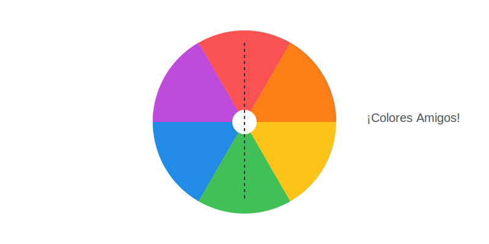

# Misión: Amigos y Enemigos (Círculo Cromático)

**Tiempo estimado**: 40 minutos  
**Nivel**: Intermedio  
**Prerrequisitos**: Saber mezclar colores básicos.

---

## 1. La Fiesta de los Colores

Imagina que los 6 colores del arcoíris se sientan a cenar en una mesa redonda (El Círculo Cromático).
Dependiendo de a quién sientes junto a quién, la conversación cambia:

### Los Vecinos (Colores Análogos) 🤝

Son los colores que viven lado a lado en la rueda. Son familia.

* Azul y Verde (Vecinos fríos).
* Rojo y Naranja (Vecinos calientes).

**Efecto**: **PAZ y CALMA**. Como se parecen, se llevan bien. Úsalos para paisajes tranquilos o fondos relajantes.

### Los Opuestos (Colores Complementarios) 💥

Son los colores que se sientan frente a frente, lo más lejos posible. ¡Son totalmente diferentes!

* Rojo ⚔️ Verde (Como la Navidad).
* Azul ⚔️ Naranja (Como el atardecer en el mar).
* Amarillo ⚔️ Morado (Como el logo de los Lakers).

**Efecto**: **¡ENERGÍA EXPLOSIVA!**. Cuando pones opuestos juntos, vibran. Se ven brillantes y chillones. Úsalos para cosas que quieras que la gente mire sí o sí (como un superhéroe).

---

## 2. Regla de Oro del Diseñador

* ¿Quieres que tu dibujo **grite** "¡MÍRAME!"? Usa **Opuestos**.
* ¿Quieres que tu dibujo **susurre** "relájate"? Usa **Vecinos**.
