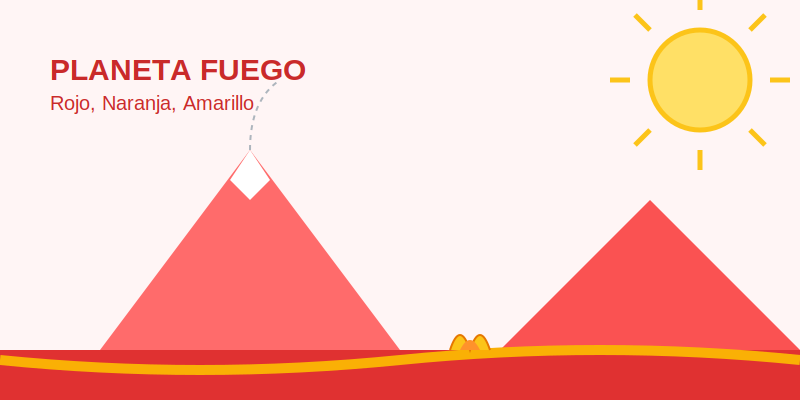

# Misión: Planeta Fuego (Colores Cálidos)

**Tiempo estimado**: 40 minutos  
**Nivel**: Básico  
**Prerrequisitos**: Saber qué es el fuego.

---

## ¡Qué Calor

Los colores tienen temperatura. No es broma.
Si entras a un cuarto pintado de rojo, tu corazón late más rápido y te da calor.
Si entras a un cuarto pintado de azul, te relajas y sientes fresco.

Hoy vamos al **Lado Caliente** del círculo:

* ☀️ **Amarillo** (Sol).
* 🍊 **Naranja** (Fuego).
* ❤️ **Rojo** (Lava).

---

## ¿Para qué sirven?

Los Colores Cálidos son:

1. **Alegres**: Como una fiesta.
2. **Peligrosos**: Como una señal de ALTO o Fuego.
3. **Cercanos**: Parecen saltar hacia tus ojos (se ven cerca).

Si quieres dibujar un dragón furioso, una explosión o un día de playa... ¡necesitas FUEGO!

---

## Truco de Sombra Caliente

Si estás pintando un sol amarillo... **¡NO USES NEGRO PARA LA SOMBRA!**
El negro ensucia el amarillo (parece lodo).

* Para sombrear Amarillo... usa **Naranja**.
* Para sombrear Naranja... usa **Rojo**.
* Para sombrear Rojo... usa **Café** o **Morado**.

¡Mantén el calor limpio!
