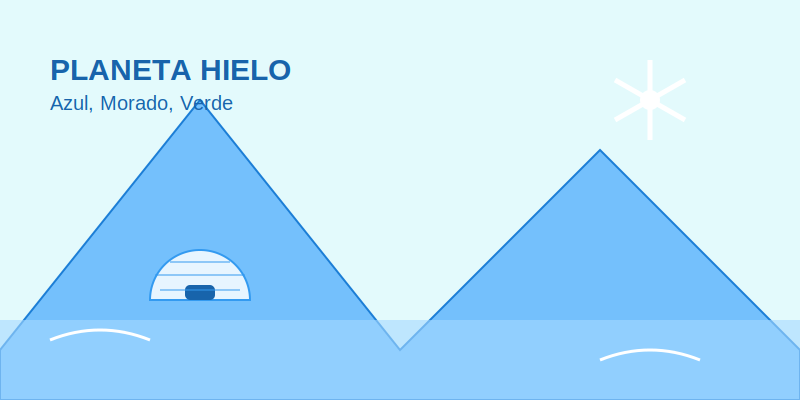

# Misión: Planeta Hielo (Colores Fríos)

**Tiempo estimado**: 40 minutos  
**Nivel**: Básico  
**Prerrequisitos**: Saber tiritar de frío.

---

## 1. ¡Brrr! Qué Frío

Ahora viajamos a la otra mitad de la rueda. Aquí todo es tranquilo, lento y helado.
Son los **Colores Fríos**:

* ❄️ **Azul** (Hielo, agua).
* 🌿 **Verde** (Bosque profundo, plantas).
* 🍇 **Morado** (Noche, fantasía, uvas).

---

## 2. ¿Para qué sirven?

Los Colores Fríos son mágicos para:

1. **Tristeza o Calma**: Si dibujas a alguien llorando o durmiendo, usa azul. Baja la energía del dibujo.
2. **La Noche**: Cuando se va el sol, el mundo se tiñe de azul y morado.
3. **Lejanía (Perspectiva Atmosférica)**: Las montañas que están muy, muy lejos... ¡se ven azulitas! El aire hace que las cosas lejanas se enfríen.

Si quieres dibujar un fantasma, un castillo de hielo o un día lluvioso... necesitas el FRÍO.

---

## 3. Secreto de Artista: Sombras de Colores

Muchos niños usan negro para pintar todas las sombras.
**¡Error!** Las sombras negras se ven agujeros vacíos.
Las sombras reales tienen color.

Los artistas usan **MORADO o AZUL OSCURO** para hacer las sombras más bonitas:

* Si dibujas un árbol verde... haz su sombra con **Azul oscuro**.
* Si dibujas una manzana roja... haz su sombra con **Morado**.

¡Inténtalo! Tu dibujo se verá más profesional y menos "sucio".
