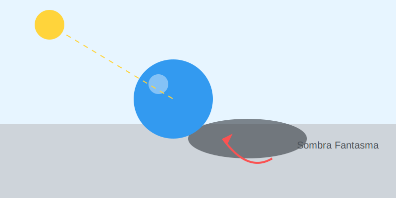

# Misión: La Sombra Fantasma (Proyectada)

**Tiempo estimado**: 35 minutos  
**Nivel**: Intermedio  
**Prerrequisitos**: Magia 3D.

---

## ¿Por qué vuelan mis dibujos?

Si dibujas una manzana perfecta, pero no le dibujas sombra en el piso...
¡Parece que está flotando como un fantasma!
No tiene peso.

Para que la manzana "pese" y toque la mesa, necesitas el **ANCLA**.
El ancla es la **Sombra Proyectada** (la mancha negra en el piso).

---

## Reglas de la Sombra de Piso

1. **Es Negra**: Especialmente justo debajo del objeto (donde lo toca).
2. **Es Alargada**: Se estira hacia el lado contrario de la luz.
3. **Es Borrosa**: Se va volviendo suavecita mientras más se aleja.

---

## El Truco del Aterrizaje

* Si la sombra está PEGADA al objeto... el objeto está en el suelo.
* Si la sombra está SEPARADA del objeto... ¡el objeto está volando!

(Piensa en un avión despegando. Su sombra se queda en el piso y se hace chiquita).
