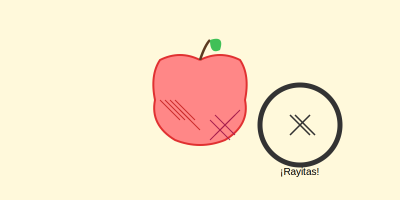

# Misión: Sombras de Rayitas (Hatching)

**Tiempo estimado**: 40 minutos  
**Nivel**: Intermedio  
**Prerrequisitos**: Saber hacer rayas.

---

## ¿Y si no puedo difuminar?

A veces dibujamos con pluma o plumón.
La tinta no se puede difuminar con el dedo (te manchas todo).
¿Cómo hacemos sombras entonces?

¡Usamos **RAYITAS**!
Esta es la técnica secreta de los Cómics y el Manga.

---

## La Regla de la Cantidad

En esta técnica, no importa qué tan fuerte aprietes el lápiz.
Lo que importa es **CUÁNTAS RAYAS** haces.

1. **Gris Claro**: Rayitas separadas (`|  |  |`).
2. **Gris Oscuro**: Rayitas juntas (`||||||`).
3. **Negro**: Rayitas cruzadas como una red (`######`).

---

## El Secreto de la Curva (Contorno)

Si vas a sombrear un brazo o una pelota, ¡tus rayitas no pueden ser rectas!
Si haces rayas rectas, el dibujo se ve plano.
Tienes que usar **Rayitas Curvas** que abracen la forma, como si estuvieras envolviendo una momia.

* Forma redonda -> Rayas curvas `((((`.
* Forma plana -> Rayas rectas `||||`.
