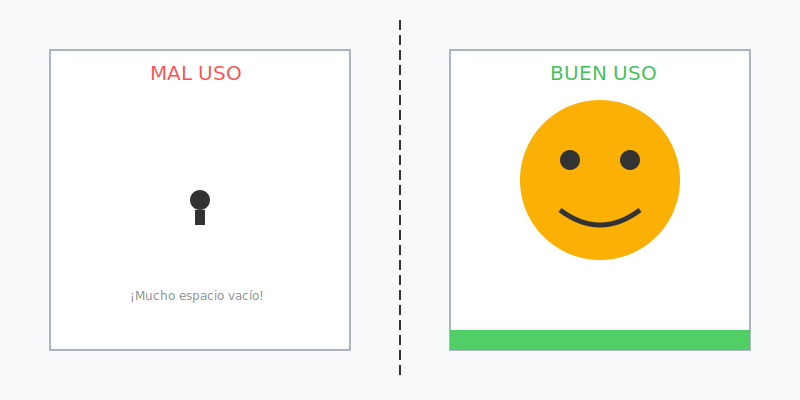

# Misión: No seas una Isla (Uso del Espacio)

**Tiempo estimado**: 35 minutos  
**Nivel**: Básico  
**Prerrequisitos**: Tener papel y no tener miedo.

---

## El Síndrome de la Hormiga

Muchos niños dibujan todo chiquitito en el puro centro de la hoja.
El resto del papel queda blanco y vacío.
¡Parece una isla desierta en medio del océano!

El papel es caro. ¡Úsalo todo!
Un dibujo profesional toca los bordes. Se siente **GRANDE**.

---

## Zonas del Papel (El Mapa)

Imagina tu hoja como un mapa:

1. **Arriba (Cielo)**: Para las cosas que vuelan o están lejos (pájaros, nubes, montañas).
2. **Abajo (Tierra)**: Para las cosas pesadas y cercanas (suelo, piedras, pies).
3. **Centro (Rey)**: Para lo más importante.
4. **Bordes (Salida)**: Las cosas pueden salirse del papel. ¡No las encierres!

---

## La Regla del Borde (Cropping)

¿Quieres que un dinosaurio se vea gigante?
Dibújalo tan grande que **NO QUEPA**.
Si dibujas solo su cabeza y dejas que el cuello se salga del papel, tu cerebro piensa: "Wow, es enorme".
Si lo dibujas entero y chiquito para que quepa, se ve como un juguete.
