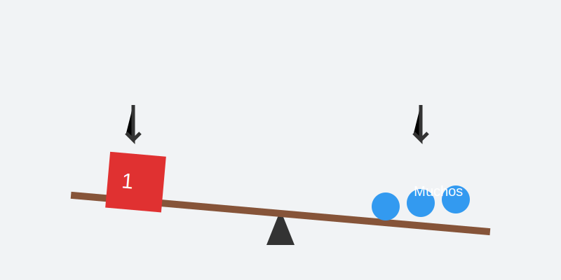

# Misión: La Balanza (El Equilibrio)

**Tiempo estimado**: 40 minutos  
**Nivel**: Intermedio  
**Prerrequisitos**: Saber usar un subibaja.

---

## ¿Tu dibujo se cae?

Imagina que tu dibujo es un plato que llevas con una sola mano.

* Si pones toda la comida a la izquierda... ¡se te cae el plato!
* Si pones toda la comida a la derecha... ¡se te cae también!

Necesitas **EQUILIBRIO** (Balance).
Hay dos formas de lograrlo:

### 1. El Espejo (Simetría)

Pones exactamente lo mismo a la izquierda y a la derecha.

* Ejemplo: Una mariposa, una cara, un palacio.
* Se siente: Serio, quieto, perfecto.

### 2. El Juego de Pesos (Asimetría)

Pones cosas diferentes, pero que pesan lo mismo.

* Izquierda: Una Roca Gigante (Pesa mucho).
* Derecha: Tres pajaritos y una nube (Pesan poco, pero juntos equilibran a la roca).
* Se siente: Divertido, natural.

---

## ¿Qué pesa en un dibujo?

* Lo **Oscuro** pesa más que lo Claro.
* Lo **Grande** pesa más que lo Pequeño.
* Lo **Rojo** pesa más que lo Azul.
