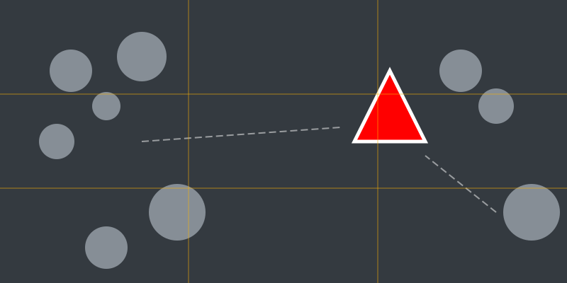

# Misión: La Estrella del Show (Punto Focal)

**Tiempo estimado**: 40 minutos  
**Nivel**: Intermedio  
**Prerrequisitos**: Querer llamar la atención.

---

## ¿Quién es el Jefe?

Si en una película todos los actores gritan al mismo tiempo... ¡nadie entiende nada!
Necesitas un **Protagonista**. Alguien a quien mirar.

En el dibujo, a ese jefe le llamamos **PUNTO FOCAL**.
Es lo primero que miran tus ojos.

---

## Cómo crear un Jefe

Tu ojo es curioso. Siempre busca lo que es **DIFERENTE**.

1. **El Diferente**: Si hay 100 ovejas blancas y 1 lobo negro... ¿a quién miras? ¡Al lobo!
2. **El Solitario**: Si todos están amontonados allá y hay uno solito aquí... miras al solito.
3. **El Color**: Si todo es gris y hay una manzana ROJA... miras la manzana.

---

## ¿Dónde lo pongo? (Regla de los Tercios)

¿Dónde pones a tu protagonista?

* ¿En el centro? Mmm, un poco aburrido.
* **Mejor**: Dibuja un "Gato" (Ta-Te-Ti) imaginario en la hoja. (#)
* Pon a tu personaje donde se cruzan las líneas. ¡Ahí se ve de película!
