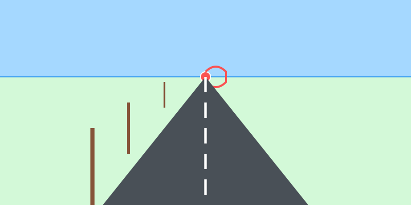

# Misión: El Imán Mágico (Perspectiva 1)

**Tiempo estimado**: 35 minutos  
**Nivel**: Intermedio  
**Prerrequisitos**: Saber usar una regla (o algo recto).

---

## 1. ¿Por qué el tren se encoge?

Si te paras en medio de las vías del tren (¡no lo hagas de verdad!) y miras a lo lejos...
Verás que los rieles de metal, que son rectos, **se juntan** hasta tocarse y desaparecer.
¿El tren se hizo pequeño? ¡No!
Es una ilusión óptica de tus ojos llamada **PERSPECTIVA**.

---

## 2. La Ley del Imán (Punto de Fuga)

Para dibujar profundidad (lejanía) en una hoja plana, necesitas usar **El Secreto del Imán**:

1. **Línea de Horizonte**: Dibuja una línea acostada en tu hoja (es el nivel de tus ojos).
2. **Punto de Fuga (El Imán)**: Dibuja un puntito en medio de esa línea.

**La Regla de Oro**:
Todas las líneas que se alejan de ti... **¡quieren ir a tocar ese puntito!**

* El camino se dobla hacia el punto.
* El techo de la casa se dobla hacia el punto.
* Hasta las nubes se hacen chiquitas viajando hacia el punto.

---

## 3. Grande vs Pequeño

Gracias a la perspectiva, tenemos una regla fácil:

* **Cosas CERCA** = Dibújalas **GIGANTES** y separadas.
* **Cosas LEJOS** = Dibújalas **DIMINUTAS** y pegaditas.
