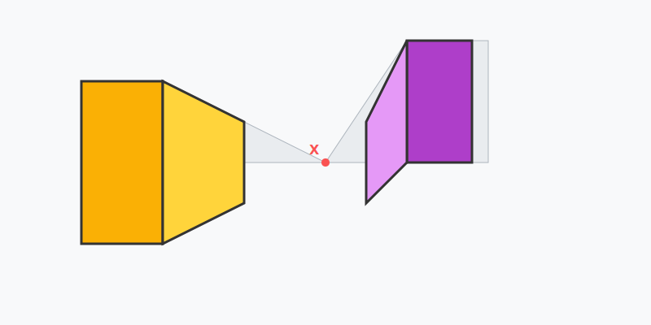

# Misión: Ciudad 3D (Cajas y Edificios)

**Tiempo estimado**: 40 minutos  
**Nivel**: Intermedio-Difícil  
**Prerrequisitos**: Carretera Infinita.

---

## De Cuadrado a Caja

Si sabes dibujar una caja, sabes dibujar un edificio, una mesa, una cama o un camión.
¡Todo son cajas!

Pero para que la caja se vea 3D, hay reglas estrictas.

### Regla 1: Las Paredes son Soldados (Verticales)

Las líneas que van de arriba a abajo (paredes) SIEMPRE deben estar derechitas como soldados (`|`).
Si las inclinas, tu edificio parece que se cae (terremoto).

### Regla 2: Los Techos obedecen al Imán (Fuga)

Las líneas que se alejan (techos, ventanas, base) siempre apuntan al **Punto de Fuga**.

---

## Cómo construir

1. Dibuja el frente de tu edificio (un rectángulo plano).
2. Desde las esquinas, dibuja líneas que vayan al Punto de Fuga.
3. Corta las líneas con una vertical (`|`) para terminar el edificio.
¡Listo!
