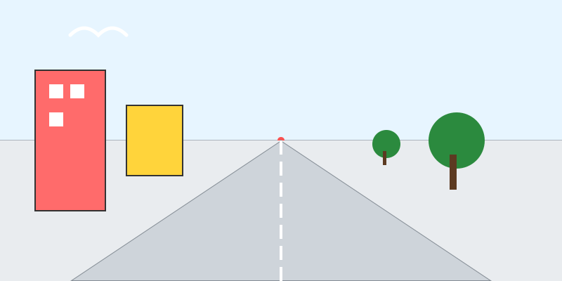

# Misión: Mi Calle Realista (Proyecto Final)

**Tiempo estimado**: 50 minutos  
**Nivel**: Difícil (¡Pero tú puedes!)  
**Prerrequisitos**: Regla y paciencia.

---

## Vamos a juntar todo

Ya sabes usar el **Imán** (Punto de Fuga).
Ya sabes hacer **Cajas** (Edificios).
Ahora dibujemos una calle de verdad.

### Las 3 Reglas de Oro para no fallar

1. **Verticales SIEMPRE Rectas**: Las paredes suben derechitas al cielo (`|`). NUNCA las inclines.
2. **Horizontales van al Imán**: Techos, pisos, ventanas y puertas... todos corren al Punto de Fuga.
3. **Lejos es Pequeño**: Las cosas al fondo son diminutas.

---

## Pasos

1. **Cruz**: Dibuja Horizonte y Punto de Fuga.
2. **Piso**: Dibuja la X desde las esquinas de abajo al punto.
3. **Cajas**: Levanta rectángulos a los lados. ¡Paredes rectas!
4. **Detalles**: Pon ventanas y puertas. ¡Usa el Imán para sus líneas de arriba y abajo!
