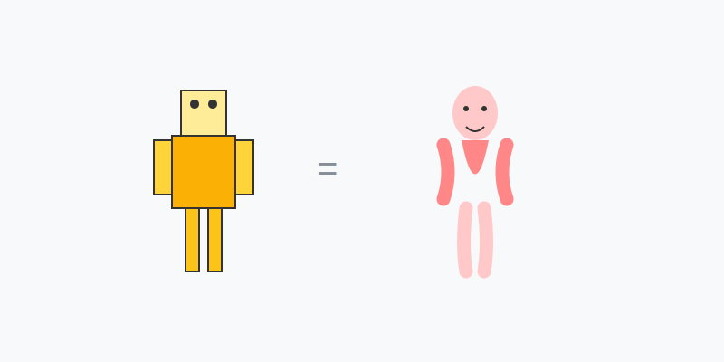

# Misión: Construyendo un Humano (Anatomía Básica)

**Tiempo estimado**: 45 minutos  
**Nivel**: Intermedio  
**Prerrequisitos**: Saber dibujar círculos y cuadrados.

---

## El Secreto del Robot

¿Crees que dibujar personas es difícil?
Es porque intentas dibujarlo todo junto (ropa, pelo, dedos).
¡Alto! Primero tienes que construir el **Maniquí**.

Imagina que somos robots hechos de piezas simples:

1. **Cabeza**: Un HUEVO.
2. **Cuerpo**: Una CAJA DE CEREAL.
3. **Brazos y Piernas**: TUBOS (Salchichas).

---

## Reglas de Conexión

1. **El Cuello**: La cabeza no flota. Conéctala a la caja con un tubo corto.
2. **Los Hombros**: Los brazos NO salen de la cintura, ni del cuello. Salen de las **esquinas de arriba** de la caja.
3. **El Largo**: Las piernas son más largas que los brazos. (Si no, pareceríamos gorilas).

---

## Pasos

1. Dibuja el Huevo (Cabeza).
2. Dibuja la Caja (Cuerpo) debajo.
3. Pon círculos en las esquinas (Hombros y Caderas). son los tornillos.
4. Conecta los Tubos (Brazos y Piernas).
¡Listo! Tienes un humano básico.
