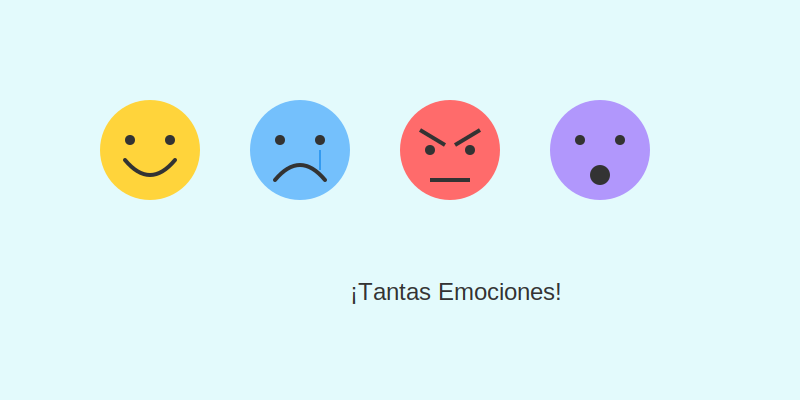

# Misión: Caras y Gestos (Emociones)

**Tiempo estimado**: 35 minutos  
**Nivel**: Básico  
**Prerrequisitos**: Tener cara.

---

## Los Jefes de la Cara

Tu cara tiene muchos músculos, pero solo necesitas mover dos cosas para contar una historia:

1. **Las Cejas** (El Jefe Supremo).
2. **La Boca** (El Ayudante).

Si dibujas a alguien en una explosión peligrosa... pero le pones carita feliz `:)`...
¡Nadie te va a creer!

---

## El Mapa de Emojis

* **Felicidad**: Cejas normales + Sonrisa `U`.
* **Tristeza**: Cejas de "Casita" `/ \` + Boca triste `(`.
* **Enojo**: Cejas de "Flecha" `\ /` + Boca recta o dientes `-`.
* **Sorpresa**: Cejas VOLANDO altas + Boca de `O`.

---

## Experimento: Mezclando

¿Qué pasa si pones cejas de enojo con boca de sonrisa?
`\ /` + `U` = ¡Villano Malvado! (Muajaja).

¿Qué pasa si pones cejas de tristeza con boca de sonrisa?
`/ \` + `U` = ¡Risa nerviosa! (Ups, rompí el plato).
