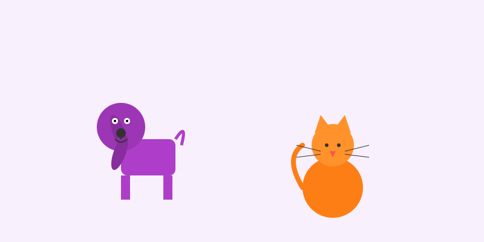

# Misión: Perros y Gatos (Mascotas)

**Tiempo estimado**: 45 minutos  
**Nivel**: Intermedio  
**Prerrequisitos**: 3 Círculos.

---

## El Secreto de las 3 Bolitas

Casi todos los animales de cuatro patas están hechos de 3 bolitas invisibles:

1. **Cabeza** (Pequeña).
2. **Pecho** (GRANDE y Fuerte).
3. **Caderas** (Mediana).

Si conectas esas 3 bolitas con una línea (columna), ¡tienes un animal!

---

## Perro vs. Gato

Aunque tienen el mismo esqueleto, son muy diferentes:

### El Perro 🐶 (Cuadrado)

* Es tieso y fuerte.
* Su pecho es ancho.
* Sus patas son gruesas.
* **Forma Clave**: CAJAS y CUADRADOS.

### El Gato 🐱 (Líquido)

* Es flexible y suave.
* Su cuerpo se estira como un chicle.
* Sus patas son finas.
* **Forma Clave**: CÍRCULOS y TUBOS LARGOS.

---

## Las Patas de Resorte

¡Cuidado! Las patas de los animales NO son palos rectos.
Tienen articulaciones raras.
Las patas de atrás se doblan como un resorte `>` para poder saltar.
Si las dibujas rectas, tu perro parecerá una mesa.
