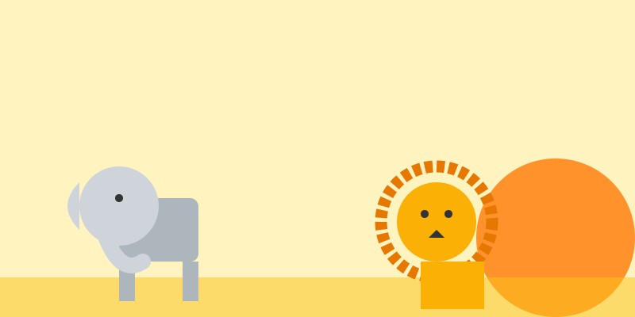

# Misión: Safari Extremo (Salvajes)

**Tiempo estimado**: 50 minutos  
**Nivel**: Intermedio  
**Prerrequisitos**: Mascotas.

---

## La Regla de la Exageración

Los animales salvajes son como caricaturas de la naturaleza.
Tienen UNA cosa exagerada.
Tu trabajo es encontrar esa cosa y dibujarla **GIGANTE**.

### 1. La Jirafa 🦒 (El Cuello)

* Es un triángulo alto.
* Todo es vertical.
* Si dibujas el cuello corto, parece un caballo raro. ¡Hazlo larguísimo!

### 2. El Elefante 🐘 (El Peso)

* Es pura masa pesada.
* Usa círculos gordos y rectángulos anchos.
* Las patas son **columnas** (rectas y gruesas) para aguantar toneladas.

### 3. El León 🦁 (El Pelo)

* Es un gato con peluca.
* La cabeza es pequeña, pero la **MELENA** es gigante.
* Dibuja una explosión de pelo alrededor de su cara.

---

## Texturas (Piel)

* **León**: Rayas rápidas (pelo).
* **Elefante**: Líneas cruzadas y arrugas (piel vieja).
* **Jirafa**: Manchas como rompecabezas.
