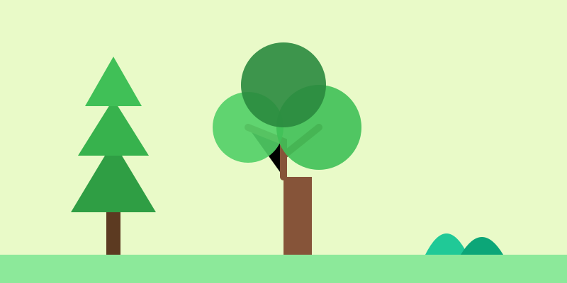

# Misión: El Bosque (Árboles)

**Tiempo estimado**: 40 minutos  
**Nivel**: Básico  
**Prerrequisitos**: Saber escribir la letra Y.

---

## No dibujes Brócolis

Muchos niños dibujan un palo café y una bola verde encima.
Eso parece un brócoli o una paleta. ¡No es un árbol!

Los árboles tienen esqueleto.
Su secreto es la letra **Y**.

---

## La Regla de la Y

1. El tronco sube y se separa en dos ramas (Y).
2. De esas ramas salen otras Y más pequeñas.
3. Y de esas, salen otras Y chiquititas.

**Regla de Oro**: El árbol siempre se hace más flaquito mientras más sube. Nunca dibujes una rama más gorda que el tronco.

---

## Tipos de Árboles

No todos son iguales.

* **El Roble (Nube)**: Es gordo y redondo. Dibuja curvas como nubes.
* **El Pino (Flecha)**: Es un triángulo picudo. Apunta al cielo.
* **La Palmera (Fuegos Artificiales)**: Un palo largo y flexible con una explosión de hojas arriba.
