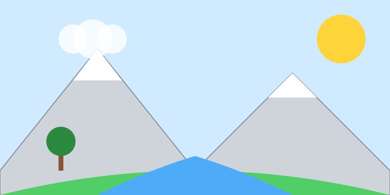

# Misión: Mi Mundo (Paisaje Completo)

**Tiempo estimado**: 50 minutos  
**Nivel**: Avanzado  
**Prerrequisitos**: Árboles, Animales, Perspectiva.

---

## La Receta del Paisaje

Un paisaje no es solo poner cosas al azar.
Necesitas **3 CAPAS** para que se vea profundo y real.

### 1. Fondo (Background) - LEJOS

* Arriba en el papel.
* Cosas: Montañas, Sol, Nubes.
* Color: Suave, borroso, azulito.

### 2. Plano Medio (Midground) - EN MEDIO

* En el centro del papel.
* Cosas: La casa, el árbol principal, el río.
* Color: Normal.

### 3. Primer Plano (Foreground) - CERCA

* Abajo en el papel. ¡Pegado a ti!
* Cosas: Una piedra, pasto detallado, una flor gigante.
* Color: Fuerte y oscuro.

---

## ¡No dejes huecos

Un error común es dejar el suelo vacío.
Ponle textura: rayitas de pasto, piedritas, camino de tierra.
¡Qué se vea que alguien vive ahí!
